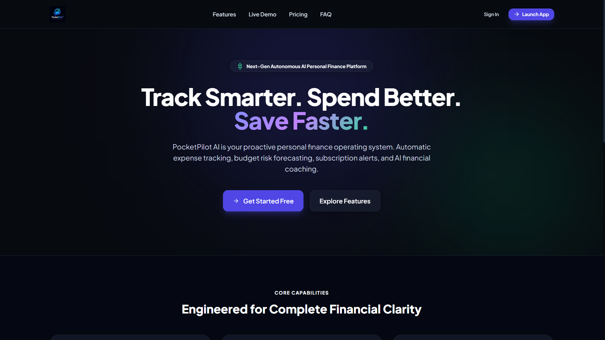
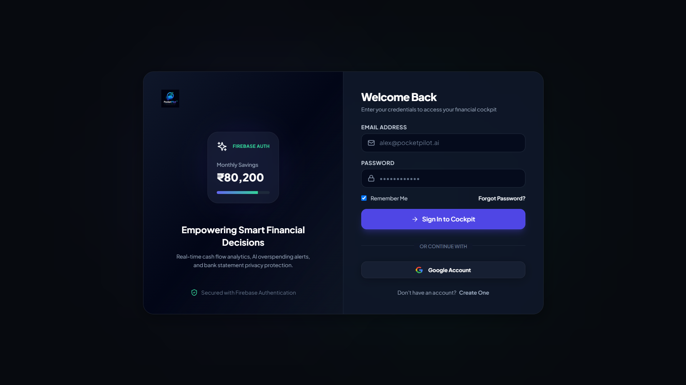
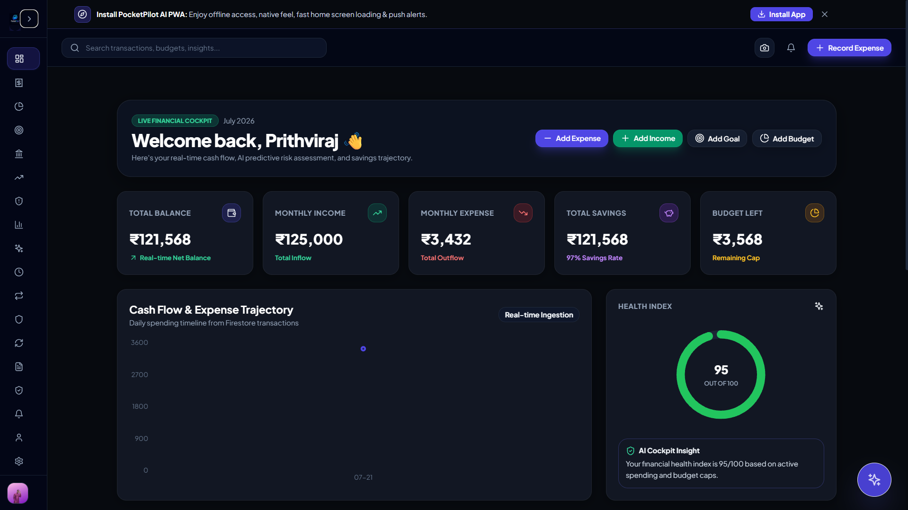
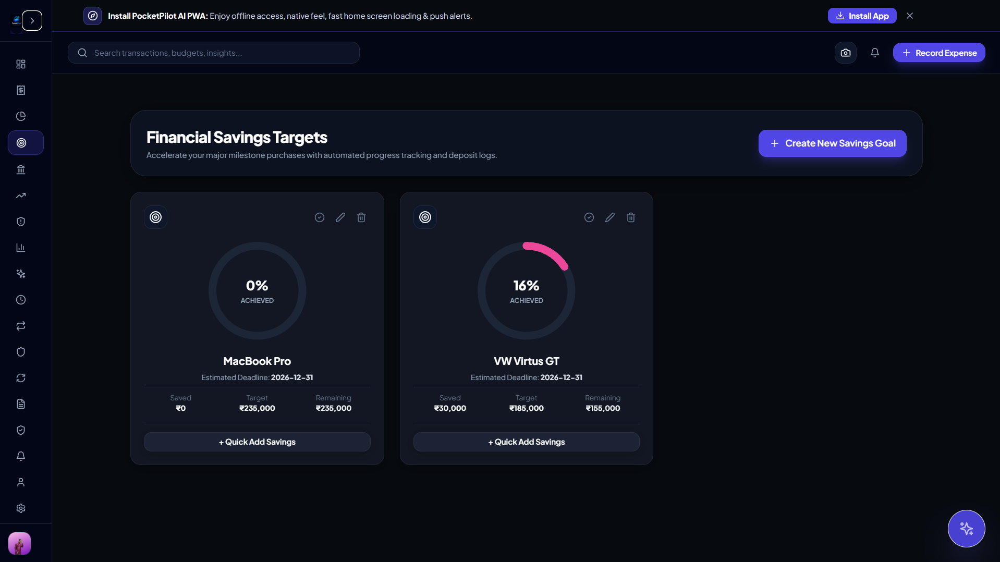
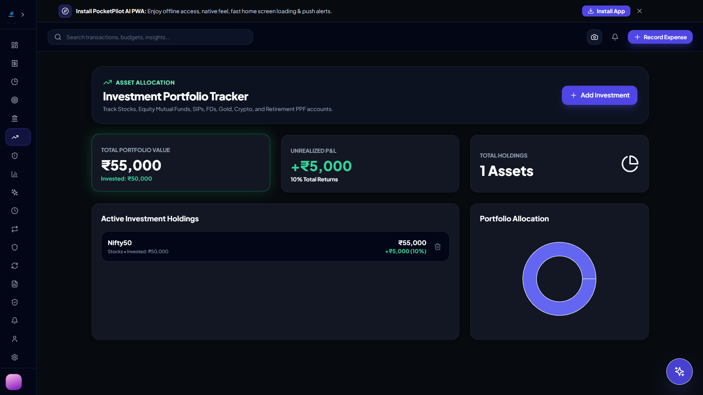
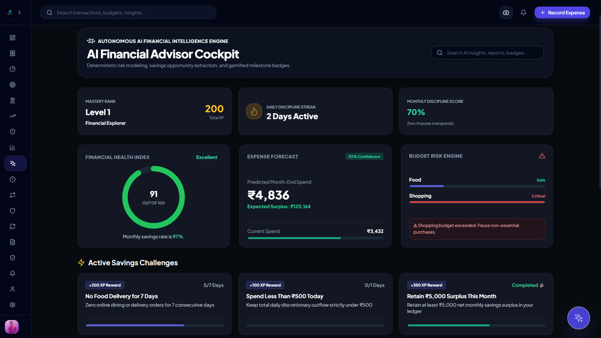
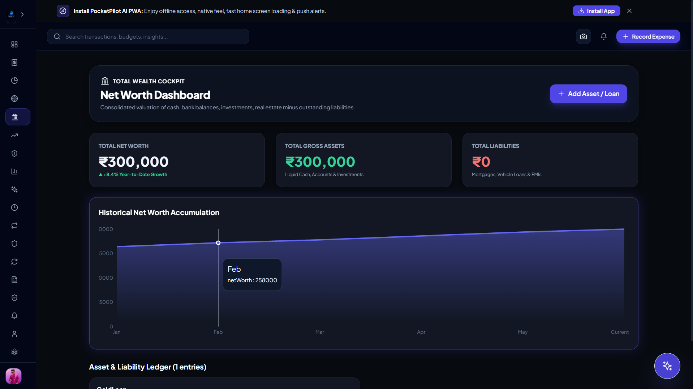

<div align="center">

# ❤️ PocketPilot AI

### AI-Powered Personal Finance Platform

Track Smarter. Spend Better. Save Faster.


<br>

[](https://pocket-pilot-ai-jet.vercel.app/)


</div>

---

# 📖 Overview

PocketPilot AI is an AI-powered personal finance platform that helps users monitor income, expenses, budgets, savings goals, investments, net worth, and financial insights through a modern dashboard.

Designed as a Progressive Web App (PWA), PocketPilot AI delivers a responsive experience across desktop and mobile while leveraging Firebase for authentication and real-time data synchronization.

---

# ✨ Features

- 🔐 Secure Firebase Authentication
- 💰 Income & Expense Tracking
- 📊 Interactive Financial Dashboard
- 🎯 Savings Goals
- 💳 Budget Management
- 📈 Investment Portfolio
- 🏦 Net Worth Tracking
- 🤖 AI Financial Advisor
- 📄 Document Vault
- 📸 OCR Receipt Scanner
- 🔔 Smart Notifications
- 📱 Progressive Web App (PWA)
- 🌙 Modern Dark UI
- ⚡ Realtime Firestore Sync

---

# 📸 Screenshots

## 🏠 Landing Page



---

## 🔐 Authentication



---

## 📊 Dashboard



---

## 💹 Financial Health



---

## 📈 Investment Portfolio



---

## 🤖 AI Financial Advisor



---

## 🏦 Wealth Dashboard



---

# 🛠 Tech Stack

### Frontend

- React
- TypeScript
- Vite
- Tailwind CSS
- Framer Motion
- Recharts

### Backend

- Firebase Authentication
- Cloud Firestore

### Deployment

- Vercel

### Architecture

- Component-Based
- Realtime Firestore
- Progressive Web App

---

# 🚀 Live Demo

https://pocket-pilot-ai-jet.vercel.app/

---

# ⚙️ Installation

```bash
git clone https://github.com/prithviraj-shahapure/PocketPilot-AI.git

cd PocketPilot-AI

npm install

npm run dev
```

---

# 🔥 Environment Variables

Create a `.env` file.

```env
VITE_FIREBASE_API_KEY=

VITE_FIREBASE_AUTH_DOMAIN=

VITE_FIREBASE_PROJECT_ID=

VITE_FIREBASE_STORAGE_BUCKET=

VITE_FIREBASE_MESSAGING_SENDER_ID=

VITE_FIREBASE_APP_ID=

VITE_FIREBASE_MEASUREMENT_ID=
```

---

# 📂 Folder Structure

```text
PocketPilot-AI
│
├── assets
│   ├── hero-banner.png
│   └── screenshots
│
├── public
├── src
├── package.json
└── README.md
```

---

# 🎯 Roadmap

- Bank Account Integration
- Voice Financial Assistant
- AI Spending Prediction
- Family Budget Sharing
- Tax Reports
- Smart Bill Automation

---

# 🤝 Contributing

Contributions are welcome.

Fork the repository, create a feature branch, and submit a pull request.

---

# 📄 License

MIT License

---

# 👨‍💻 Developer

**Prithviraj Shahapure**

B.Tech Artificial Intelligence & Machine Learning

GitHub: https://github.com/prithviraj-shahapure

---

<div align="center">

⭐ If you found this project useful, please consider giving it a star.

Built with ❤️ using React, TypeScript, Firebase & Tailwind CSS.

</div>
